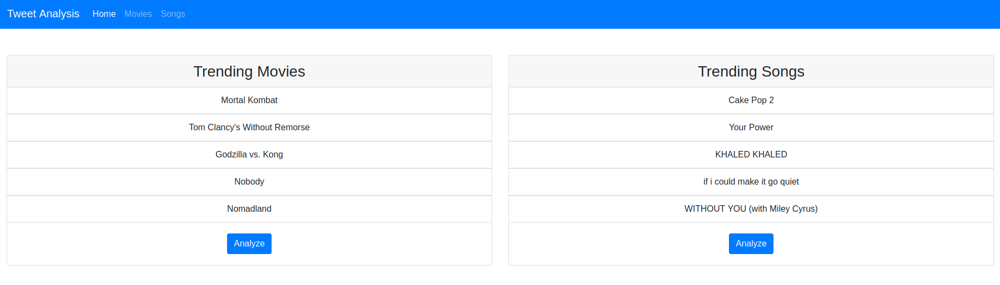

# 🚀 Twitter Sentiment Analysis

### Website Preview
##### Home Page


##### Tweets Page


##### Dashboard Page


----

## **🌟 Problem Description** 📋  
In today’s fast-paced digital world, people rely on **Twitter** to stay updated on trending topics across various domains. Movies and songs frequently dominate these trends, with users and critics sharing their opinions.  

⚡️ **Challenge?** Scrolling through countless tweets to grasp public sentiment is time-consuming and tedious.  
✨ **Solution?** This **real-time sentiment analysis web app** allows users to quickly assess public opinion on trending movies and songs without manually browsing Twitter.  

🔍 **What does it do?**  
- Fetches the latest trending **movies & songs** from **Spotify & TMDB**  
- Analyzes sentiment from **live Twitter feeds**  
- Presents data visually using **Google Data Studio**  
- Sends **personalized email reports** with trending content  

---

## **🛠 Tech Stack**  
💻 **Backend**: Python, Django  
🎨 **Frontend**: HTML, CSS, Bootstrap  
☁️ **Cloud Services**: Google Cloud Platform (Pub/Sub, Dataflow, BigQuery, Data Studio, App Engine)  
📊 **Data Processing**: Apache Beam, Twitter API  

---

## **📦 Installation & Setup**  
### **Step 1: Clone the Repository**  
```bash
git clone https://github.com/your-username/twitter-sentiment-analysis.git
cd twitter-sentiment-analysis
```

### **Step 2: Install Required Libraries**  
```bash
pip install -r requirements.txt
```

### **Step 3: Run the Server Locally**  
```bash
python manage.py runserver
```
🌍 **Access the app at:** [localhost:8000](http://localhost:8000)  

---

## **✨ Key Features** 📌  
✔ **Real-Time Tweet Collection**: Fetches 1,000+ tweets at a time using **Pub/Sub**  
✔ **Sentiment Analysis**: Detects **positive, negative, or neutral** sentiments from tweets  
✔ **Data Visualization**: Presents insights via **Google Data Studio**  
✔ **Performance Optimization**: Uses **Dataflow** for autoscaling & workload balancing (50% faster response time)  
✔ **User-Friendly Reports**: Sends trending movie & song insights **via email**  

---


---

